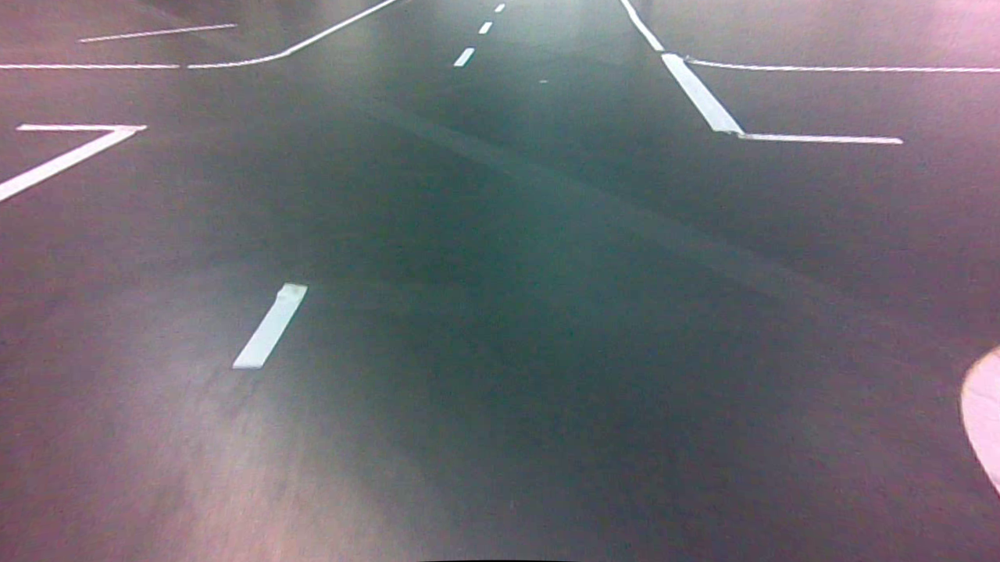
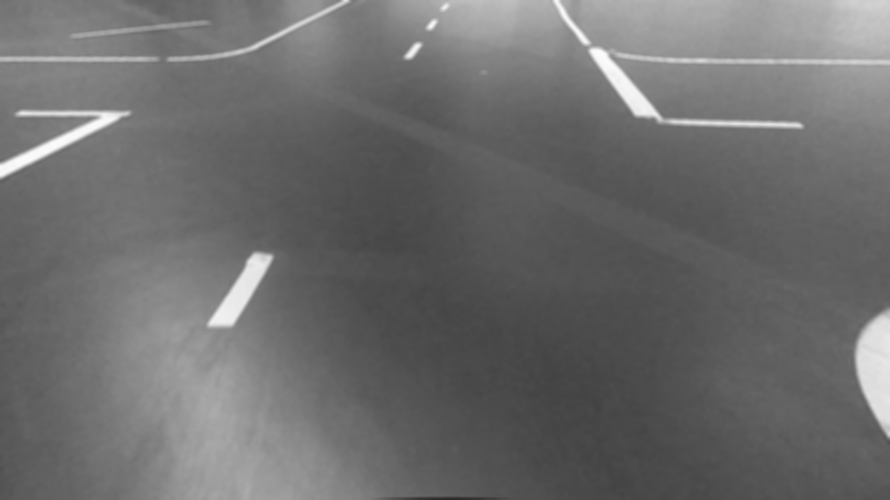
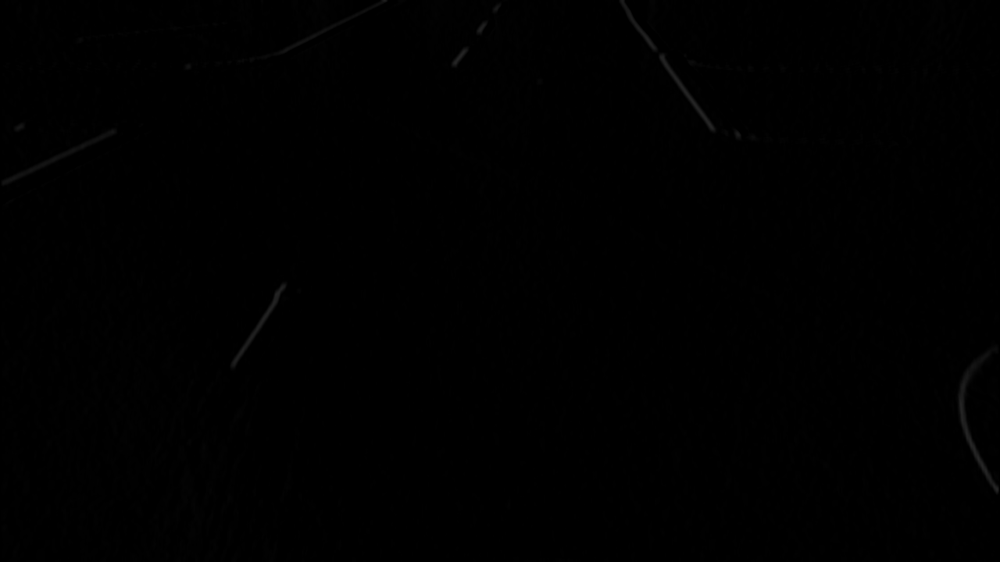
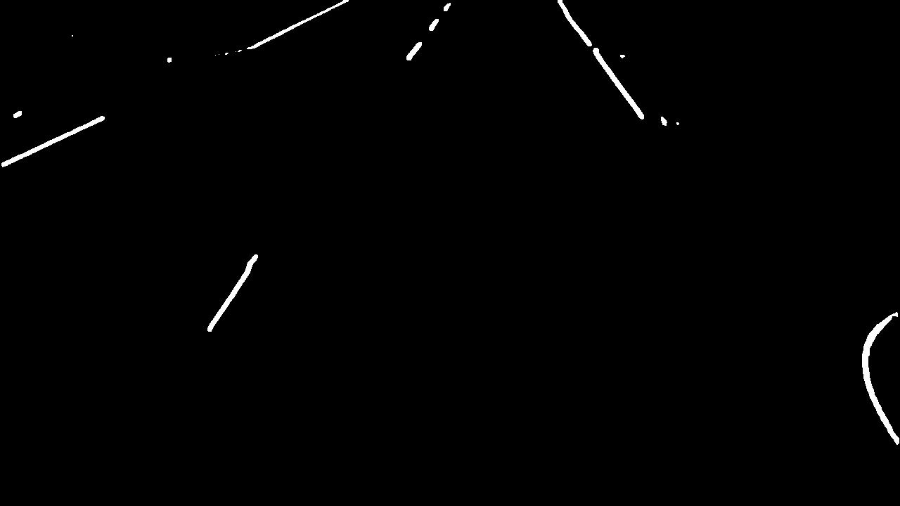
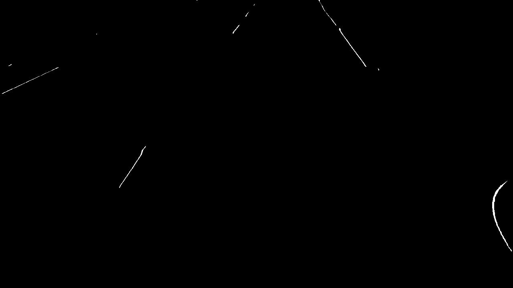
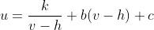
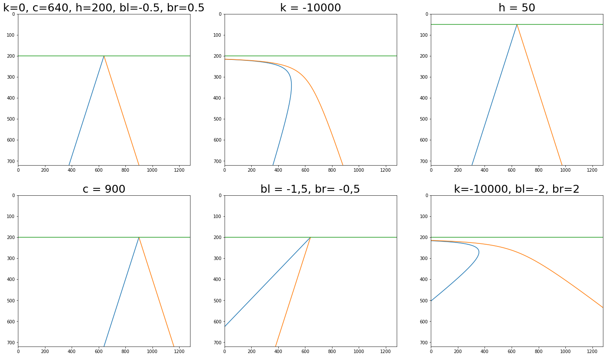

<!-- PROJECT LOGO -->
<br />
<p align="center">

  <h1 align="center">Robust lane detection and parameter estimation</h3>

  <p align="center">
    Lightweight lane detection in realtime with a hyperbola-pair lane model
    <br />
  </p>
</p>


<!-- TABLE OF CONTENTS -->
<details open="open">
  <summary><h2 style="display: inline-block">Table of Contents</h2></summary>
  <ol>
    <li>
      <a href="#about-the-project">About The Project</a>
      <ul>
        <li><a href="#method">Method</a></li>
        <li><a href="#built-with">Built With</a></li>
      </ul>
    </li>
    <li>
      <a href="#getting-started">Getting Started</a>
      <ul>
        <li><a href="#installation">Installation</a></li>
      </ul>
    </li>
    <li><a href="#usage">Usage</a></li>
    <li><a href="#license">License</a></li>
    <li><a href="#contact">Contact</a></li>
  </ol>
</details>


<!-- ABOUT THE PROJECT -->
## About The Project


Extracting the lane for autonomous vehicles is a common task. It can be split into the problem of extracting which pixels in an image belong to lane boundaries and combining those pixels into a lane model.

In the Carolo-Cup [[1]] competition the second task is more demanding. The lane boundaries are white tape on a dark ground. Lane pixel can be easily found with basic computer vision operations. The challenge lies in creating a robust lane model from the edge pixels.

This repo provides a lane detection pipeline to extract a lane polynomial for the Carolo-Cup on a Jetson Nano in real time. Lane pixel are extracted using edge detection algorithms and processed into a hyperbola-pail lane model from the following paper. <cite>[Chen, Qiang, and Hong Wang. "A real-time lane detection algorithm based on a hyperbola-pair model."[2]]</cite>


[1]: https://wiki.ifr.ing.tu-bs.de/carolocup/carolo-cup
[2]: https://ieeexplore.ieee.org/abstract/document/1689679


### Method

#### Lane Boundaries

The following preprocessing steps are taken:
| | | |
|:-------------------------:|:-------------------------:|:-------------------------:|
|  Undistort |  Grayscale |  Blur |
|  Horizontal Sobel |  Binary |  Erode |

The final image contains vertical edges which represent potential lane boundaries.

#### Lane Model

The used lane model is called the hyperbola-pair model, because the lane boundaries are model by a hyperbola.

Such a lane is described in the perspective view with the following equation:
<p align="center">

</p>
(u,v) are image coordinates, k describes the curvature, h is the height of the horizon in image coordinates, b is a shift of a lane boundary, while c is a shift of the entire lane.

Whats special about this model is, that it works in perspective view in contrast to models in birdseye view.

A left and right lane boundary can be described by altering the b parameter. All other parameters remain the same. This means that both lane boundaries influence the lane model, which increases its robustness. Furthermore the difference between the b_left and the b_right parameter stay the same, because that difference is related to the lane width.

The following image shows the influence of the parameters on the lane model.



To calculate the parameters b,c,k a least-squares problem is minimized.

### Built With

* [OpenCV](https://opencv.org/)
* [NumPy](https://numpy.org/)
* [SciPy](https://www.scipy.org/)


<!-- GETTING STARTED -->
## Getting Started

To get a local copy up and running follow these simple steps.

### Installation

1. Clone the repo
   ```sh
   git clone https://github.com/aelmiger/lane_detection.git
   cd lane_detection
   ```
2. Install requirements
   ```sh
   pip install -r requirements.txt
   ```

<!-- USAGE EXAMPLES -->
## Usage

Change settings in the 'constants.py' file and run the script
```sh
python3 lane_detection_script.py
```
<!-- LICENSE -->
## License

Distributed under the MIT License. See `LICENSE` for more information.


<!-- CONTACT -->
## Contact

Anton Elmiger - [anton.elmiger@gmail.com](mailto:anton.elmiger@gmail.com) - email